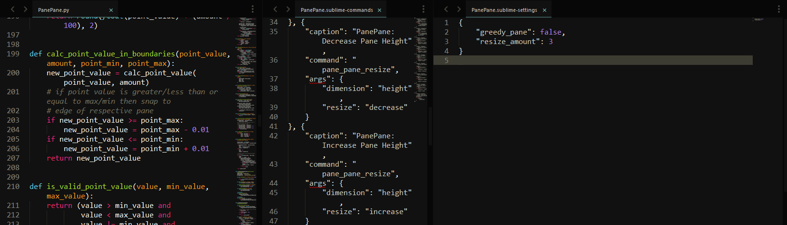

# :warning: **PanePane is inactive and no longer maintained.** :warning:
> Feel free to fork and make it your own. Better yet, come join me on [Neovim](https://neovim.io/) :smile:.

# PanePane
Sublime Text 3 plugin to resize panes via keyboard shortcuts.

## Installation
### [Package Control][package_control]
1. Open the command palette, press `ctrl` + `shift` + `p` (Windows/Linux) or `command` + `shift` + `p` (Mac) 
2. Enter the command `Package Control: Install Package`
3. Type `PanePane`

### [Git][github]
1. Navigate to the Packages directory
    * Open the command palette, press `ctrl` + `shift` + `p` (Windows/Linux) or `command` + `shift` + `p` (Mac) 
    * Enter the command `Preferences: Browse Packages`
2. `git clone https://github.com/mjsmith1028/PanePane.git`

## Features
The following commands are available via keyboard shortcuts or the command palette:

| Command               | Windows/Linux Shortcut | Mac Shortcut              |
|:----------------------|:-----------------------|:--------------------------|
| Decrease Pane Width   | `ctrl` + `<`           | `command` + `ctrl` + `<`  |
| Increase Pane Width   | `ctrl` + `>`           | `command` + `ctrl` + `>`  |
| Equal Pane Width      | `ctrl` + `alt` + `=`   | `command` + `ctrl` + `=`  |
| Decrease Pane Height  | `ctrl` + `shift` + `<` | `command` + `shift` + `<` |
| Increase Pane Height  | `ctrl` + `shift` + `>` | `command` + `shift` + `>` |
| Equal Pane Height     | `ctrl` + `shift` + `=` | `command` + `shift` + `=` |
| Toggle Greedy Pane    | `n/a`                  | `n/a`                     |
| Settings - Default    | `n/a`                  | `n/a`                     |
| Settings - User       | `n/a`                  | `n/a`                     |

## Settings
| Setting               | Description                                        | Type    | Default |
|:----------------------|:---------------------------------------------------|:--------|:--------|
| greedy_pane           | If true, then adjust adjacent panes during resize  | Boolean | false   |
| resize_amount         | The amount to resize pane in the range of 1 to 100 | Integer | 3       |

## Greedy Pane Demo

## Recommended Packages
The following packages are recommended in conjunction with PanePane to improve Sublime Text's layouts and pane management.

| Package       | URL                                              |
|:--------------|:-------------------------------------------------|
| Origami       | https://packagecontrol.io/packages/Origami       |
| InactivePanes | https://packagecontrol.io/packages/InactivePanes |

[package_control]: https://packagecontrol.io/packages/PanePane
[github]: https://github.com/mjsmith1028/PanePane 
